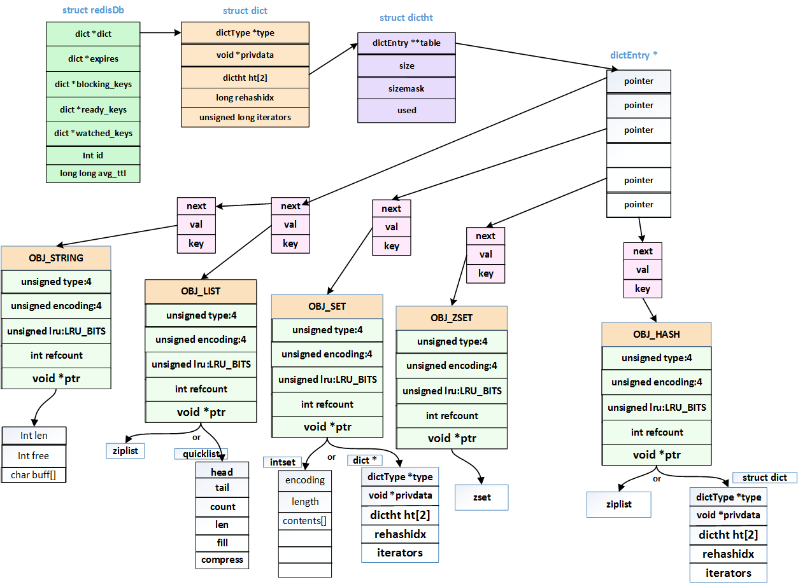
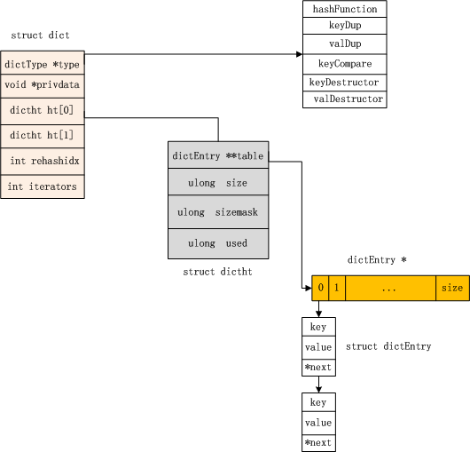
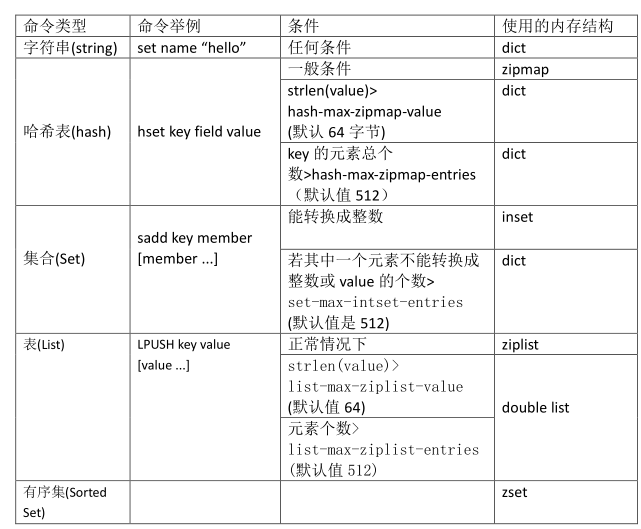
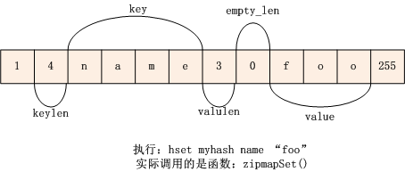

---

---

# Redis核心数据结构分析

## 引言

​	对于面向对象的软件，主要知道其类图及其关系，就会对该软件的设计有一个总体的把握了。同样，对于用C语言编写的Redis来说，理解其中的数据结构，可以说就对其软件的架构设计的优劣掌握了一半。所以，理解Redis的数据结构非常关键，它是理解Redis核心设计的钥匙。

​	本章主要分析Redis设计中的核心数据结构。通过本章的分析，可以清楚的知道：保存到Redis中的数据是如何存储的。

## Redis核心数据结构概览



​									图1 Redis核心数据结构总图

## Redis核心数据结构分析

### redisDb结构

​	Redis的数据库结构。从上图可以看出Redis的所有数据都保存在该结构组织的数据结构中。在Redis初始化时一般会初始化16个数据库(默认的数据库个数)，如下：

```c
// 默认数据库个数定义
#define CONFIG_DEFAULT_DBNUM     16
```

​	也可以在配置文件中设置数据库的个数，如下：

```c
// 读取配置文件中databases参数的值
if (!strcasecmp(argv[0],"databases") && argc == 2) {  
            // 把配置文件中的数据库个数值读取到server数据结构的dbnum变量中
            server.dbnum = atoi(argv[1]); 
            if (server.dbnum < 1) { 
                err = "Invalid number of databases"; goto loaderr;
            }    
... ...          
```

### dict结构

该结构用来管理保存数据的Hash结构：dictht，定义如下：

```c
typedef struct dict {
    dictType *type; 
    void *privdata;
    dictht ht[2];	// 用来保存数据库数据的hash结构(后面有详细讲解)
    long rehashidx; /* rehashing not in progress if rehashidx == -1 */
    unsigned long iterators; /* number of iterators currently running */
} dict;
```

通过一个结构图来表示，如下：



​									图2 dict结构图	

​	从上图可以看到，该结构包括两个保存数据的dictht结构的hash表，这两个dictht hash表就是最终保存key/value数据的地方。

### dictht结构

该结构是保存key/value的hash表结构，该结构的定义如下：

```c
typedef struct dictht {
    dictEntry **table;
    unsigned long size;
    unsigned long sizemask;
    unsigned long used;
} dictht;
```

​	从图2中可以直观的看出dictht的结构。该结构包括一个动态数组table，该数组保存dictEntry结构的指针，从图上可以看出，数组中每个dictEntry指针其实就是一个链表的头结点，其中size字段记录了该数组的当前长度。

### dictEntry

该结构是hash表的节点结构，所有key/value的数据都封装在该结构中。该结构的定义如下：

```C
typedef struct dictEntry {
    void *key;
    union {
        void *val;     // 指向真正的数据的位置，其值可能是某个类型实体的指针。
        uint64_t u64;  //value是64位整数
        int64_t s64;   //value是整数
        double d;      //value是double型数据
    } v;
    struct dictEntry *next;  //指向下一个结点
} dictEntry;
```

​	从该结构中可以看出，key和val都是void*类型。所以，key和val都可以是任意类型，从而在Redis中衍生出多种数据类型。

## Redis类型数据结构分析

​	在Redis中有多种不同类型的数据，比如：hash，list，set，zset等。虽然，从上一节的分析我们得知，所有的数据都是分装在dictEntry实体中的，但不同类型的实体的key和val的内存结构是不同的。

下表是不同类型命令对应数据结构的总结：



### zipmap结构

​	如果redisObject的type 成员值是 REDIS_HASH 类型的,则当该hash 的 entry 小于配置值: hash-max-zipmap-entries 或者value字符串的长度小于
hash-max-zipmap-value, 则可以编码成 REDIS_ENCODING_ZIPMAP 类型存储,以节约内存. 否则采用 dict 来存储

​	zipmap的实质是用一个字符串数组来依次保存key和value，查询时是依次遍列每个key-value 对，直到查到为止。

​	若我们设置了保存了以下两个map值：

```
"foo" => "bar"
"hello" => "world"
```

​	通过zipmap存储的内存结构样子如下：

```
<zmlen><len>"foo"<len><free>"bar"<len>"hello"<len><free>"world"
```

#### 初始化的zipmap内存结构


​	初始化时只有 2 个字节的空间，第 1 个字节表示 zipmap 保存的 key-value 对的个数(如果 key-value 对的个数超过 254，则一直用 254 来表示，zipmap 中实际保存的 key-value 对个数可以通过 zipmapLen() 函数计算得到)。

​	zipmap结构的初始化函数代码如下：

```
/* Create a new empty zipmap. */
unsigned char *zipmapNew(void) {
    unsigned char *zm = zmalloc(2); // 分配有两个字节的内存空间

    zm[0] = 0; 	/* key/value的个数 */
    zm[1] = ZIPMAP_END;
    return zm;
}
```

#### 执行hset后zipmap内存结构

假设我们执行了以下命令：

```
hset myhash name "foo"
```

执行命令后zipmap的内存结构如下：



由上图我们可以看出：

* 第1个字节保存key/value 对(即 zipmap 的 entry 数量)的数量 1
* 第2个字节保存key_len值：4
* 第3~6个字节保存key："name"
* 第7个字节保存value_len值：3
* 第8个字节保存空闲的字节数 0 (当 该 key 的值被重置时,其新值的长度与旧值的长度不一定相等,如果新值长度比旧值的长度大,则通过realloc来扩大内存。如果新值长度比旧值的长度小，且相差大于 4 bytes ,则 realloc 缩小内存，如果相差小于 4，则将值往前移，并用empty_len保存空闲的字节数)
* 第 9~13 字节保存 value 值 "foo"

此时，若我们继续执行命令：

```
hset myhash k1 "v1"
```

此时的内存结构如下：


继续若我们修改了k1的值，内存结构如下：


​	如果 key 或value 的长度小于ZIPMAP_BIGLEN(254)，则用一个字节来表示，如果大于ZIPMAP_BIGLEN(254)，则用5个字节保存,第一个字节为保存ZIPMAP_BIGLEN(254)，后面4个字节保存 key或value 的长度。

### ziplist结构

​	如果 redisObject 的 type 成员值是 REDIS_LIST 类型的，则当该 list 的elem 数小于配置值：hash-max-ziplist-entries 或者 elem_value 字符串的长度小于 hash-max-ziplist-value，则可以编码成 REDIS_ENCODING_ZIPLIST 类型存储,以节约内存。否则采用 dict 来存储。    

​	ziplist 实质是一个字符串数组形式的双向链表。

(待续...)

